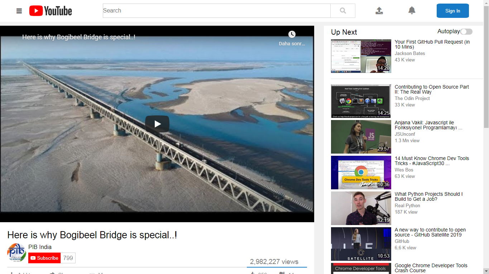

# Youtube Clone

> Youtube is cloned as a project of microverse

This project was started with Hasan and Prabhakar, but then Prabhakar couldn't continue the program for this month.

## Built With
-HTML 
-CSS
-http://archive.vn/Bss88 is used as a source to clone

## Live Demo

[Live Demo Link](https://raw.githack.com/ozovalihasan/youtubeCloneByHasan/master/index.html)

## Authors

👤 **Hasan Özovalı**

- Github: [@githubhandle](https://github.com/ozovalihasan)
- Twitter: [@twitterhandle](https://twitter.com/ozovalihasan)
- Linkedin: [linkedin](https://www.linkedin.com/in/hasan-ozovali/)

👤 **Prabhakar Pandey**

- Github: [@githubhandle](https://github.com/Prabhakarzx)

## 🤝 Contributing

Contributions, issues and feature requests are welcome!

Feel free to check the [issues page](issues/).

## Show your support

Give a ⭐️ if you like this project!

## Acknowledgments

Thanks to Microverse because of help to build this project

## 📝 License

This project is [MIT](lic.url) licensed.